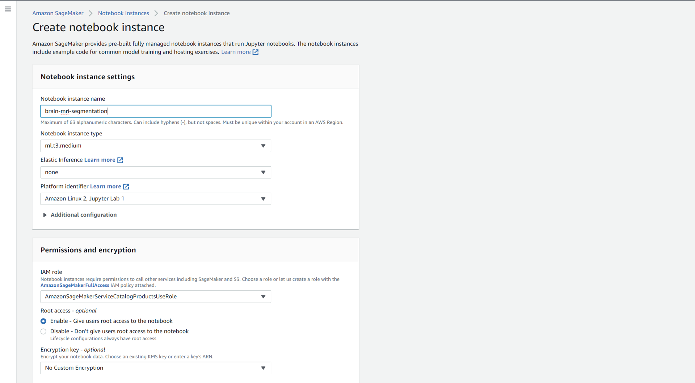

# Brain MRI segmentation on AWS SageMaker
This repository contains the code for the final project of the [Udacity AWS ML Engineer nanodegree](https://www.udacity.com/course/aws-machine-learning-engineer-nanodegree--nd189). For this work I chose to work on the [Brain MRI segmentation](https://www.kaggle.com/datasets/mateuszbuda/lgg-mri-segmentation) dataset available on Kaggle. 

  

## Objective
The goal of this work is to build an end-to-end machine learning solution with AWS SageMaker for segmentation of brain MRI images to detect lower-grade gliomas (a form of brain tumour). The animation above shows an example of the three channel MRI images (the data consists of 2D slices from a 3D volume) on the left and the corresponding segmentation mask on the right, with white indicating a tumour.

The aim is to achieve reasonable segmentation performance, but obtaining state-of-the-art results is not the objective here. Once we have a workflow established then new models can always be tested later.

## Tools
Some of the important tools used in this work (aside from AWS SageMaker) include:

- [PyTorch Lightning](https://www.pytorchlightning.ai): For organizing the model training code. 
- [MONAI](https://monai.io/): Open source framework for deep learning applied to medical imaging.
- [Weights & Biases](https://wandb.ai/site): Online MLOps platform with experiment tracking and model versioning.
- [Optuna](https://optuna.readthedocs.io/en/stable/index.html): Python package for performing hyperparameter tuning.

## Repo organization
The main subfolders found inside this Git repository include:

### imgs
This contains a few images and GIF files that are used as documentation for ths README file and in various notebooks.

### notebooks
This folder contains the Jupyter Notebooks for running the project. Rather than having everything in one large notebook, it has been broken down into the following:

- **01_data-prep-eda.ipynb** - Downloads the data from Kaggle, splits into datasets, uploads to S3 bucket and perform exploratory data analysis.

- **02_train-and-deploy-sagemaker.ipynb** - This notebook shows a number of ways that models can be trained with SageMaker. This includes doing everything in a local Docker container to submitting training jobs to run on EC2 instances. An example of running hyperparameter tuning and deploying the best model is also provided.

- **03a_optuna-hpo-1_unet_analysis.ipynb** - A hyperparameter search for a UNet architecture was run locally. This notebook analyses the results.

- **03b_optuna-hpo-2_unet-attention.ipynb** - Same as above but for an Attention UNet network.

- **04_deploy-best-optuna-model.ipynb** - The best model from the Optuna hyperparamer search is deployed as a SageMaker endpoint and the performance on the validation dataset is reviewed.

### sagemaker_src
This folder contains the code needed to run training on SageMaker. When a training job is started it is copied to the SageMaker Docker container used to run the job. This includes:
- **brain_datamodule.py** - Contains the code to create the `BrainMRIData` class which is a subclass of the PyTorch Lightning `LightningDataModule`. This takes care of loading the data and creating the DataLoaders for training. 
- **brain_model.py** - Includes the `BrainMRIModel` class which inherits from the PyTorch Lightning `Lightning Module`. This organizes the training code and currently includes two options for model architecture (UNet and Attention UNet).
- **inference.py** - This includes the `model_fn` and `predict_fn` functions which are required by SageMaker when deploying a model.
- **requirements.txt** - This is the additional Python dependencies that need to be installed inside the SageMaker container to run the training jobs. It's not for creating a local Python environment.
- **train.py** - This is used as the entry point for training jobs run on SageMaker containers.

### scripts
Contains the scripts used in this project.

- **optuna-hpo.py** - This is used to run a local Optuna hyperparameter search. It was built using the `typer` library so you can see the help options for using it.

### src
This folder contains the code for doing the data preparation and visualization outside of a Training Job on an AWS instance. 

- **data.py** - This module includes all of the functionality needed for creating Kaggle API keys, downloading the data, preparing the data and finally uploading it to an S3 bucket.
- **predict.py** - Useful functions that can be run on deployed models to make predictions.
- **utils.py** - Some utility functions such as generating SageMaker settings and tasks related to Weights and Biases.
- **visualize.py** - various functions for plotting data and results.

## Getting started
I ran everything from my own laptop and submitted jobs to SageMaker when necessary. It is possible to run the first two notebooks using a SageMaker Notebook instance, but these instructions will focus on what to do for local training and submission.

**Note:** I am running everything on Ubuntu 18.04 on WSL2. You may encounter issues if you try to run things on Windows.

### General requirements

1. Make sure you have [set up an AWS account](https://aws.amazon.com/premiumsupport/knowledge-center/create-and-activate-aws-account/)
2. [Create a new AWS SageMaker Execution role](https://docs.aws.amazon.com/sagemaker/latest/dg/sagemaker-roles.html)
    - This should have at least `AmazonS3FullAccess` and `AmazonSageMakerFullAccess` policies attached
    - Note that if you create a SageMaker Notebook instance, you can create a new Execution role as part of this process.
3. Sign up for a [Kaggle account](https://www.kaggle.com/) if you don't already have one.
4. Sign up for a [Weights and Biases account](https://wandb.ai/site) (optional)

### Running locally with job submission to AWS
To be able to run the notebooks on your local machine and submit any SageMaker Training Job to an SageMaker instance on AWS you will need to:

1. [Install and setup the AWS CLI](https://docs.aws.amazon.com/cli/latest/userguide/getting-started-install.html)

2. Clone the project repo to your own machine:
    - Run `git clone https://github.com/robsmith155/udacity-nd-aws-ml-engineer-final-project.git` 

3. Create Python virtual environment
    - First create a virtual environment. I used [pyenv](https://github.com/pyenv/pyenv) and [venv](https://docs.python.org/3/library/venv.html) to manage my environments. In this case I used Python v3.8.13.
    - Activate the virtual environment you created
    - Change directory to where you cloned the project repo and run `pip install -r requirements.txt`. Note this is the file in the root directory of the Git repo, **not** the file inside the `sagemaker_src` directory.

### Running locally with ability to train on local SageMaker containers (optional)
Optionally, if you want the ability to train on local SageMaker Docker containers you also need to setup Docker Desktop on your machine. Although it can be tricky to get everything working, this is worth it in the end if you are developing for things to run on SageMaker. This means you can test your code much faster as you don't need to wait for an EC2 instance to start, download the Docker image and start. It is also free.

#### Useful information for setting up Docker on machine
- Instructions for installing with a WSL2 backend on Windows can be found here: [Docker Desktop WSL 2 backend | Docker Documentation](https://docs.docker.com/desktop/windows/wsl/) This installs Docker Desktop and Docker Compose
- To check that it is running okay on WSL2, open a terminal and try:  `docker run hello-world`. This should pull the `hello-world` image and run it.
- This page gives details about running CUDA applications on WSL2 [CUDA on WSL :: CUDA Toolkit Documentation (nvidia.com)](https://docs.nvidia.com/cuda/wsl-user-guide/index.html)
- Next I needed to install the NVIDIA Container Toolkit which includes a container runtime library. Instructions are found [here](https://docs.nvidia.com/ai-enterprise/deployment-guide/dg-docker.html#enabling-the-docker-repository-and-installing-the-nvidia-container-toolkit).
- To check if Docker can use your GPU, you can try running: `docker run --rm -it --gpus=all nvcr.io/nvidia/k8s/cuda-sample:nbody nbody -gpu -benchmark`

### SageMaker Notebook instances
The first two notebooks can be run from a SageMaker Notebook instance. To set this up:

1. Go to the SageMaker console, go toe `Notebook instances` under `Notebook` in the left hand menu, then click `Create notebook instance`.

  

2. Give the notebook instance a name. You can leave the default options, which will create a new SageMaker Execution role which is attached to the notebook instance.

  

3. Once the notebook instance is active, launch Jupyter Lab.

  

4. Open a terminal, `cd` to the `SageMaker` directory and clone the project repo:

`git clone https://github.com/robsmith155/udacity-nd-aws-ml-engineer-final-project.git`

  

Now you can open the first notebook in the `notebooks` folder. Note that when you run these notebooks, you will need to uncomment the first code cell in the notebooks to install the missing dependencies.

### Developers
If you want to further develop the code, it is recommended to setup [pre-commit](https://pre-commit.com/) which will run linting and formatting checks prior to committing code changes. With the virtual environment active, make sure you're in the root directory of your clone of the project repo. Then run:

`pre-commit install`

Now when you before committing anything will Git a number of hooks will be run to check that the code meets certain requirements (such as PEP8). These hooks use various packages including [flake8](https://flake8.pycqa.org/en/latest/), [black](https://github.com/psf/black) and [isort](https://pycqa.github.io/isort/).

## Reproducing results
In general, you can work through the notebooks in order. These are well documented and provide instructions on what you need to do. Some important details are also provided in this section.

### Setting up datasets
The notebook named `01_data-prep-eda` will take care of downloading the data, splitting into datasets and (if needed) uploading the data to an S3 bucket. However if you decide not to run this notebook it is also included in the next. 

To download the dataset using the [Kaggle CLI](https://github.com/Kaggle/kaggle-api) we need to create an API token. So that we don't need to recreate this every time we want to interact with Kaggle, we can place it in a file located at `~/.kaggle/kaggle.json` (where `~` represents the users home directory). Here we can use the `create_kaggle_token_file` to create this file and make sure it has the correct permissions. 

Before running this you will need to login to your Kaggle account and create a new API token (if you don't already have one). 

1. Go to your Kaggle account

Sign into [Kaggle](https://www.kaggle.com/) and click on your profile picture (top right corner). Select `Account`.

    

2. Create new API token

Now scroll down to the API section and click on `Create New API Token`.

    

When prompted to, enter your Kaggle username and API token in the notebook. The dataset should then be downloaded for you.

### SageMaker Training Jobs
Various examples of running SageMaker training jobs are provided in the notebook named `02_train-and-deploy-sagemaker.ipynb`. Depending on where you are running the notebook from (i.e. locally or on a SageMaker Notebook instance) will control which options you can run.

However, as pointed out in the notebook, running Training Jobs and hyperparameter searches using AWS SageMaker instances is not a good solution for this small dataset. 

### Running Optuna hyperparameter search
The search should be run on your local machine which ideally enables training with GPU. The search should be run using the `optuna-hpo.py` script inside the `scripts` folder. You can see the help documentation for this script with the various options and parameters by running:

`python optuna-hpo.py --help` 

This should display something like shown below in the terminal:

  

An example of starting a hyperparameter search (from inside the `scripts` folder):

`python optuna-hpo.py --model-type 'unet' --max-epochs 50 --no-fast-mode --num-trials 100 --num-workers 4 --study-name 'opuna-hpo-1'`

This will start an Optuna study named `optuna-hpo-1` which will perform a hyperparameter search for the UNet architecture running 100 trials each for a maximum of 50 epochs.

Once you have run a hyperparameter search, you can use the code in `03a_optuna-hpo-1_unet_analysis.ipynb` to review the results.

## Results summary

The experiments for this project have been tracked with Weights and Biases. The results for this project can be found [here](https://wandb.ai/robsmith155/brain-mri-segmentation?workspace=user-robsmith155).

The best model so far was produced by a basic UNet architecture withe the following hyperparameters:
- Dropout rate: 0.01974680258630745
- Learning rate:0.0010872470329461143
- Number of filters in block 1: 32
- Batch size: 16

This produced a model with a Dice score of 0.839 on the validation dataset. Examples of the validation predictions are shown below:

  

The Weights and Biases page for the corresponding run can be viewed below or following [this](https://wandb.ai/robsmith155/brain-mri-segmentation/runs/mwk66y5o?workspace=user-robsmith155) link which shows training metrics, system information and also contains a copy of the model.

<iframe src="https://wandb.ai/robsmith155/brain-mri-segmentation/runs/mwk66y5o?workspace=user-robsmith155" width="1200" height="1000"></iframe>